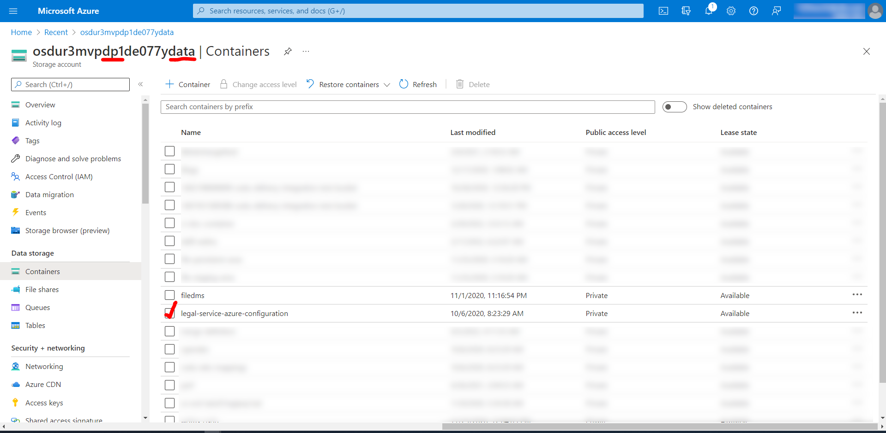
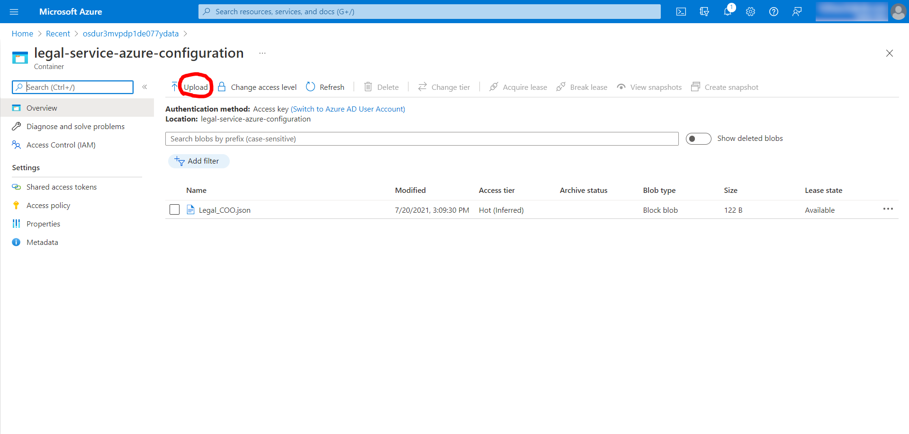

# Allow Data Ingestion from Specific Country of Origin

We can allow certain country as a valid COO(Country of Origin) by uploading customized legal configuration file into cloud storage. It will override the default configuration for legal service.

## Configuration Steps

Following steps can be taken to allow a specific COO:

1.  Refer to following example and create a `Legal_COO.json` file:
```
   [{
  "name": "Brazil",
  "alpha2": "BR",
  "numeric": 76,
  "residencyRisk": "Client consent required",
  "typesNotApplyDataResidency": ["Transferred Data"]
   }]
```

To obtain the proper alpha, numeric code, and data types without applying data residency constraints (`alpha2`, `numeric`, `typesNotApplyDataResidency` fields), please refer to the [Legal Service Default Configuration](https://community.opengroup.org/osdu/platform/security-and-compliance/legal/-/blob/master/legal-core/src/main/resources/DefaultCountryCode.json) 
then enter the appropriate restriction level in the `residencyRisk` field.

!!! Note "Residency Risk"

	Usually we set `residencyRisk` to `Client consent required` when we are allowing data from this country as an exception, but please consult with business if this is the correct value here.

2.  Go to cloud storage location where we store legal config file. For example `Azure resource group - dev dp1`:  



3.  Go to the `legal-service-azure-configuration` container and upload the `Legal_COO.json` file created in step 1, replace the existing item with the same name if existed:

   

!!! Note "Make sure filename matches exactly"

	Please make sure the file name is exactly the same with the existing file `Legal_COO.json`, it's case-sensitive.